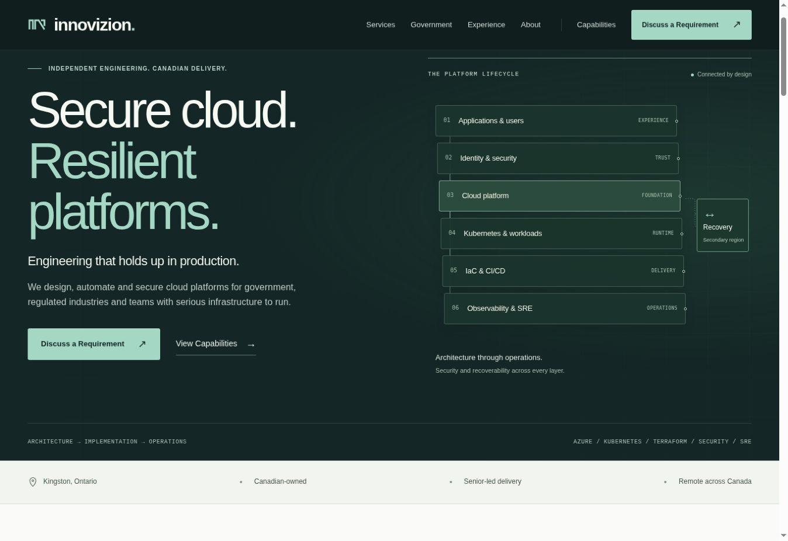

# Production deployment verification

Verified: 2026-09-30 UTC (2026-09-29, America/Toronto).

- Website: https://www.innovizion.ca/
- Release commit: `36c24743c15f486e7d253cd5911ee5a4215d18ff`
- Verification: https://github.com/vibhuanand/innovizion.ca/actions/runs/36659858581 — success.
- GitHub Pages: https://github.com/vibhuanand/innovizion.ca/actions/runs/36659857919 — build, deploy and status reporting succeeded.
- Previous production: `backup/pre-overhaul-2026-09-29`, commit `1d7af7944e883b3dde049303e112f5d7d280bbc1`.

## Production checks

The live homepage and all 16 additional pages loaded in Chrome with the expected headings, titles, canonical URLs and current stylesheet version `f896289e7c`. The original domain and Pages hosting remain in use.

- HTTP www redirects to HTTPS www.
- HTTPS apex redirects to HTTPS www.
- `generic.html` redirects to `/about/`; `elements.html` redirects to `/services/`.
- An intentionally missing page displays the custom 404 content.
- The contact flow presents a focused error summary for invalid input and prepares the expected encoded email draft for valid input. No message was sent.
- The capability statement is live. Its print layout was validated locally.
- Sitemap and robots content passed build validation and was included in the successful deployment. Direct production retrieval of these two files was blocked by the test browser URL policy; no workaround was attempted.
- Local Lighthouse results remain lab measurements; no production Lighthouse result is claimed. Safari/iOS and manual assistive-technology checks remain outstanding.

## Rollback

Revert the website release commit through Git and publish that revert on the existing `main` branch. Do not delete the deployment or change DNS. The backup branch preserves the original complete tree.

## Live homepage

